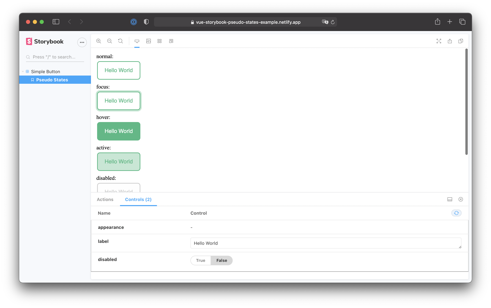

<h1 align="center">Storybook Addon Pseudo States for Vue</h1>

This repository contains an example setup of the `storybook-addon-pseudo-states` [addon for Vue](https://github.com/Ergosign/storybook-addon-pseudo-states/tree/master/src/vue). Check out the instructions there or view the [live demo](https://vue-storybook-pseudo-states-example.netlify.app/?path=/story/simple-button--pseudo-states).

## Scripts

The example was scaffolded with Vue CLI, so you can use:

- Compile and hot-reloads for development: `npm run serve`
- Compiles and minify for production: `npm run build`
- Run your tests: `npm run test`
- Lint and fix files: `npm run lint`
- Run storybook: `npm run storybook`
- Build storybook for production: `npm run build-storybook` (outputs to `storybook-static/`)
